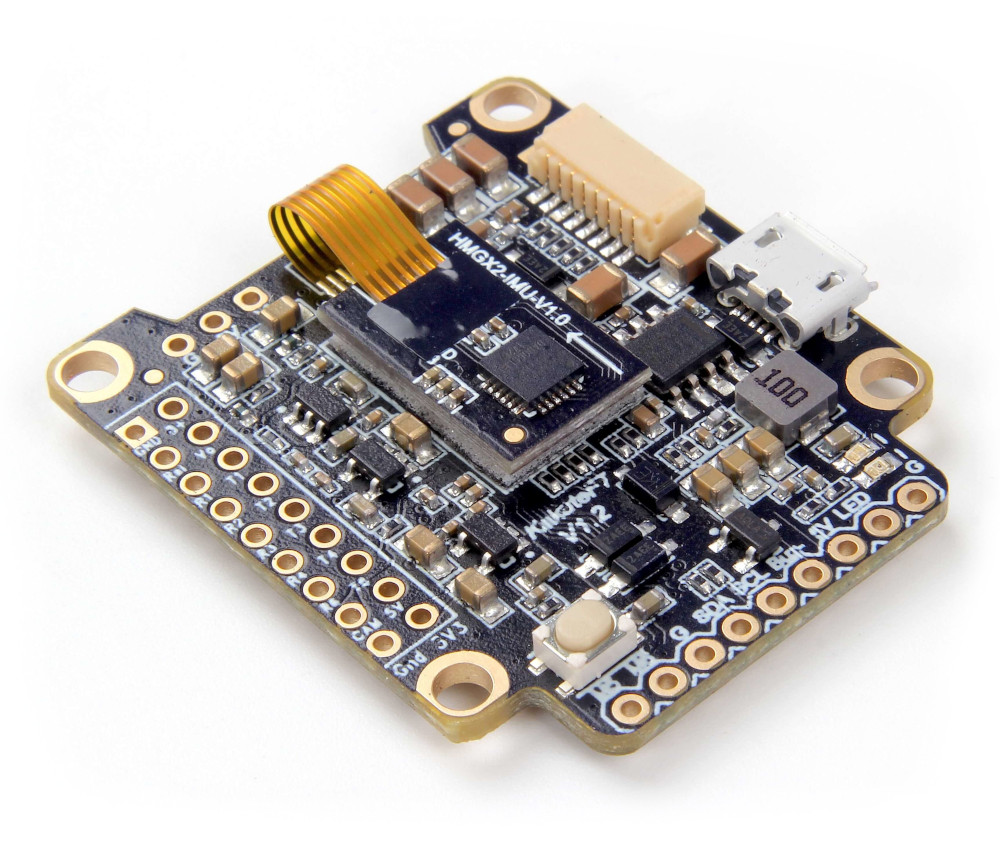
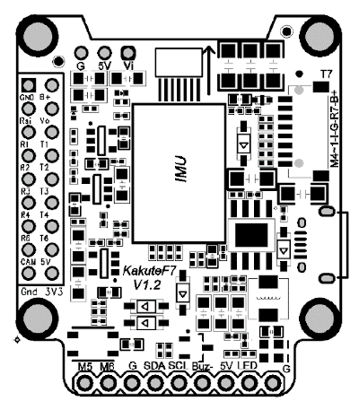

# Kakute F7

The *Kakute F7* from Holybro is a flight controller board designed for racers. 




## Key Features

* Main System-on-Chip: [STM32F745VGT6](https://www.st.com/en/microcontrollers-microprocessors/stm32f745vg.html)
  * CPU: 216 MHz ARM Cortex M7 with single-precision FPU
  * RAM: 320 KB SRAM
  * FLASH: 1 MB
* Standard racer form factor: 36x36 mm with standard 30.5 mm hole pattern
* ICM20689 Accel / Gyro (Soft-mounted)
* BMP280 Baro
* microSD (for logging)
* 6 UARTs
* 1 I2C bus
* 6 PWM outputs
* built-in OSD chip (AB7456 via SPI)


## Where to Buy

The board can be bought for example from one of the following shops:
- [Holybro](https://shop.holybro.com/kakute-f7_p1104.html) 
- [getfpv](https://www.getfpv.com/holybro-kakute-f7-tekko32-f3-metal-65a-4-in-1-esc-combo.html)

> **Tip** The Kakute F7 fits with the Tekko32 4-in-1 ESC.

## Connectors and Pins

This is the silkscreen for the Kakute F7, showing the top of the board:




| Pin              | Function                              | PX4 default |
| ---------------- | ------------------------------------- | ----------- |
| B+ | Battery positive voltage (2S-6S) ||
| 5V | 5V output (2A max) ||
| VO | Video output to video transmitter ||
| VI | Video input from FPV camera ||
| G or GND | Ground ||
| SDA, SCL | I2C connection (for peripherals) ||
| R1, T1 | UART1 RX and TX | TELEM1 |
| R2, T2 | UART2 RX and TX | TELEM2 |
| R3, T3 | UART3 RX and TX | NuttX debug console |
| R4, T4 | UART4 RX and TX | GPS1 |
| R6, T6 | UART6 RX and TX | RC port |
| R7, T7 | UART7 RX and TX (RX is located in the plug for use with 4-in-1 ESCs) ||
| LED | WS2182 addressable LED signal wire (not tested) ||
| Buz- | Piezo buzzer negative leg (Connect buzzer positive leg to 5v pad) ||
| 3V3 | 3.3v output (200 mA max) ||
| M1 to M4 | Motor signal outputs (located in plug) ||
| M5, M6 | Additional motor signal outputs (located at side of board) ||
| RSI | Analog RSSI (0-3.3v) input from receiver ||
| Boot | Bootloader button ||


TODO: parts of the following is duplicated from the Omnibus board.

## PX4 Bootloader Update {#upload}

The board comes pre-installed with [Betaflight](https://github.com/betaflight/betaflight/wiki). 
Before PX4 firmware can be installed, the *PX4 bootloader* must be flashed.

There are two options for flashing the bootloader: via *Betaflight Configurator* (easier), or building from source (guaranteed to work).

### Bootloader Update using Betaflight Configurator {#betaflight_configurator}

To install the PX4 bootloader using the *Betaflight Configurator*:
1. Download the pre-built bootloader binary: [omnibusf4sd_bl.hex](https://github.com/PX4/px4_user_guide/raw/master/assets/flight_controller/omnibus_f4_sd/omnibusf4sd_bl_d52b70cb39.hex).
1. Download the [Betaflight Configurator](https://github.com/betaflight/betaflight-configurator/releases) for your platform.
   > **Tip** If using the *Chrome* web browser, a simple cross-platform alternative is to install the configurator as an [extension from here]( https://chrome.google.com/webstore/detail/betaflight-configurator/kdaghagfopacdngbohiknlhcocjccjao). 
1. Connect the board to your PC and start the Configurator.
1. Press the **Load Firmware [Local]** button
   
1. Select the bootloader binary from the file system and then flash the board.

You should now be able to install PX4 firmware on the board.

### Bootloader Update using Source

#### Download Bootloader Source

Download and build the [Bootloader](https://github.com/PX4/Bootloader) via:
```
git clone --recursive  https://github.com/PX4/Bootloader.git
cd Bootloader
make omnibusf4sd_bl
```

#### Flash Bootloader

You can flash the PX4 bootloader using the [dfu-util](http://dfu-util.sourceforge.net/) or the graphical [dfuse](https://www.st.com/en/development-tools/stsw-stm32080.html) tool on windows.

Don't be afraid to try flashing using any of the below methods. 
The STM32 MCU cannot be bricked. 
DFU cannot be overwritten by flashing and will always allow you to install a new firmware, even if flashing fails.

##### Enter DFU mode

Both methods require the board to be in DFU mode. 
To enter DFU mode, hold the boot button down while connecting the USB cable to your computer. 
The button can be released after the board is powered up.

##### dfu-util

```
dfu-util -a 0 --dfuse-address 0x08000000 -D  build/omnibusf4sd_bl/omnibusf4sd_bl.bin
```

Reboot the flight controller and it let it boot without holding the boot button.

##### dfuse

See the dfuse manual is here: https://www.st.com/resource/en/user_manual/cd00155676.pdf

Flash the `omnibusf4sd_bl.bin` file.


## Building Firmware

To [build PX4](https://dev.px4.io/en/setup/building_px4.html) for this target:
```
make holybro_kakutef7_default
```

## Installing PX4 Firmware

The firmware can be installed in any of the normal ways: 
- Build and upload the source
  ```
  make holybro_kakutef7_default upload
  ```
- [Load the firmware](../config/firmware.md) using *QGroundControl*.
  You can use either pre-built firmware or your own custom firmware.


## Configuration

In addition to the [basic configuration](../config/README.md), the following parameters are important:

Parameter | Setting
--- | ---
[SYS_HAS_MAG](../advanced_config/parameter_reference.md#SYS_HAS_MAG) | This should be disabled since the board does not have an internal mag. You can enable it if you attach an external mag.
[MOT_ORDERING](../advanced_config/parameter_reference.md#MOT_ORDERING) | If you use a 4-in-1 ESC with Betaflight/Cleanflight motor assignment, this parameter can be set accordingly.


## Reinstall Betaflight {#reinstall_betaflight}

In order to switch back to *Betaflight*:
- Backup the PX4 parameters, e.g. by [exporting](https://dev.px4.io/master/en/advanced/parameters_and_configurations.html#exporting-and-loading-parameters) them to an SD card
- Keep the **bootloader** button pressed while attaching the USB cable
- Then flash *Betaflight* as usual with the *Betaflight-configurator*

